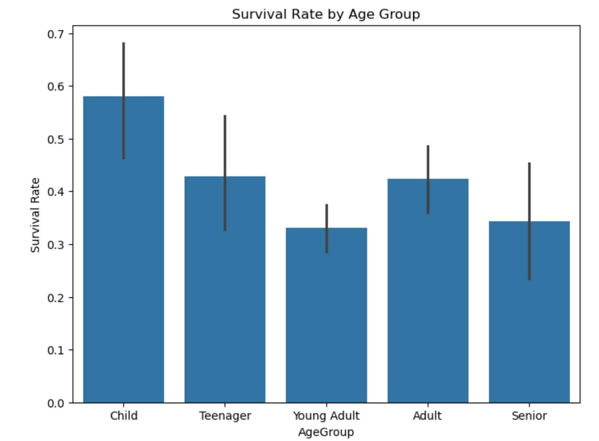

# Titanic ML Models - Model Card

Analyze Titanic passenger data with Logistic Regression &amp; Random Forest. Identify key factors influencing survival.

## Basic Information
**Names:** N M Emran Hussain  
**Email:** nmemranhussain2023@gmail.com
**Date:** October 2024  
**Model Version:** 1.0.0  
**License:** [MIT License](LICENSE)

## Intended Use
**Purpose:** The model predicts survival on the Titanic dataset using various machine learning algorithms.  
**Intended Users:** Data scientists, machine learning enthusiasts, educators.  
**Out-of-scope Uses:** The model is not intended for production use in any critical applications or real-time decision-making systems.

## Model Details
**Architecture:** This model utilizes linear models such as Logistic Regression, Random Forest, etc., for classification tasks.  
**Training Data:** Titanic dataset provided by [Kaggle](https://www.kaggle.com/c/titanic/data).  
**Evaluation Metrics:** Area Under the Curve (AUC) and Average Information Retrieval (AIR).

## Responsible AI
This model was built using packages that promote responsible AI practices, such as:
* **[PiML]()** for interpretable machine learning.
* **[InterpretML](https://github.com/interpretml/interpret)** for explaining and visualizing model predictions.

**Fairness Considerations:** Biases in the training data, particularly related to gender and class, have been considered. Interpretability tools were used to understand the model’s behavior and its impact on protected groups.

## Training Data
**Dataset Name:** Titanic Training Data  
**Number of Samples:** 891  
**Features Used:** Passenger class, gender, age, fare, etc.  
**Data Source:** [kaggle](https://www.kaggle.com/c/titanic/data?select=train.csv)

### Splitting the Data for logistic regression model
The dataset was divided into training and validation data as follows:
- **Training Data Split:** 80%
- **Validation Data Split:** 20%

### Splitting the Data for random forest model
The dataset was divided into training and validation data as follows:
- **Training Data Split:** 70%
- **Validation Data Split:** 30%

### Data Dictionary

| Column Name     | Modeling Role  | Measurement Level | Description                            |
|-----------------|----------------|-------------------|----------------------------------------|
| PassengerId     | Identifier     | Nominal           | Unique ID for each passenger           |
| Survived        | Target          | Binary            | 1 if the passenger survived, 0 otherwise|
| Pclass          | Feature        | Ordinal           | Passenger class (1st, 2nd, 3rd)        |
| Name            | Feature        | Nominal           | Name of the passenger                  |
| Sex             | Feature        | Nominal           | Gender of the passenger (Male/Female)  |
| Age             | Feature        | Continuous        | Age of the passenger                   |
| SibSp           | Feature        | Continuous        | Number of siblings/spouses aboard      |
| Parch           | Feature        | Continuous        | Number of parents/children aboard      |
| Ticket          | Feature        | Nominal           | Ticket number                          |
| Fare            | Feature        | Continuous        | Fare paid by the passenger             |
| Cabin           | Feature        | Nominal           | Cabin number                           |
| Embarked        | Feature        | Nominal           | Port of embarkation (C = Cherbourg, Q = Queenstown, S = Southampton) |

## Test Data

### Source of Test Data
The Titanic test dataset used in this model is sourced from [Kaggle](https://www.kaggle.com/c/titanic/data?select=gender_submission.csv).

### Number of Rows in Test Data
- **Number of rows in Test Data:** 418

### Differences Between Training and Test Data
- The test dataset does not include the `Survived` column, which is the target variable in the training dataset.
- All other feature columns are the same between the training and test datasets.

## Model Details

### Columns Used as Inputs in the Final Model
The following columns were used as inputs (features) in the final model:
- Pclass
- Sex
- Age
- SibSp
- Parch
- Fare
- Embarked

### Column(s) Used as Target(s) in the Final Model
- **Target Column:** Survived

### Type of Models
The first model used is a **Logistic Regression** classifier. [Link to Jupyter Notebook](https://github.com/nmemranhussain/titanic-ml-models/blob/main/Titanic_logistic%20(1).ipynb)
The second model used is a **Random Forest** classifier [Link to Jupyter Notebook](https://github.com/nmemranhussain/titanic-ml-models/blob/main/Titanic_RF.ipynb)

### Software Used to Implement the Model
- **Software:** Python (with libraries such as Pandas, Scikit-learn)
- **Version of the Modeling Software:** scikit-learn 1.x

### Hyperparameters or Other Settings of the Model
The following hyperparameters were used for the 'logistic regression' model:
- **Solver:** lbfgs
- **Maximum Iterations:** 100
- **Regularization (C):** 1.0
- Features used in the model: ['Pclass', 'Age', 'SibSp', 'Parch', 'Fare', 'Sex_male', 'Embarked_Q', 'Embarked_S']
- Target column: Survived
- Model type: Logistic Regression
- Hyperparameters: Solver = lbfgs, Max iterations = 500, C = 1.0
- Software used: scikit-learn sklearn.linear_model._logistic

The following hyperparameters were used for the 'random forest' model:
- Columns used as inputs': ['Pclass', 'Sex', 'Age', 'Fare'], 
- Target column: 'Survived',
- Type of model: 'Random Forest Classifier',
- Software used: 'scikit-learn',
- Software version: '0.24.1'

## Quantitative Analysis

### Metrics Used to Evaluate the Final Model
The following metrics were used to evaluate the final model: 
* **AUC (Area Under the ROC Curve)**: Measures the model's ability to distinguish between positive and negative classes.

### Final Values of Metrics for All Data using 'logistic regression' model:

| Dataset     | AUC   | 
|-------------|-------|
| Training    | 0.88  | 
| Validation  | 0.86  |
| Test        |       | 

### Final Values of Metrics for All Data using 'random forest' model:

| Dataset     | AUC   | 
|-------------|-------|
| Training    | 0.86  | 
| Validation  | 0.86  | 
| Test        |       | 

### Plots Related to Data or Final Model
 
 

**Description**: 

 

**Description**: 

 

**Description**: 

## Insights using Logistic Regression Model ##
The model's AUC of 0.88 and AIR of 0.88 on training data indicate strong performance, showing that it effectively distinguishes between passengers who survived and those who did not, with high precision across thresholds. However, these scores are based on training data, so there’s a potential risk of overfitting. To ensure the model generalizes well, it's crucial to evaluate on validation or test data and make adjustments if performance drops significantly.

The model's AUC of 0.86 and AIR of 0.83 on validation data suggest that it performs well in distinguishing between survivors and non-survivors on unseen data, though slightly lower than the training data. This indicates that the model generalizes reasonably well. The slight drop from training to validation metrics suggests that the model is not significantly overfitting.

The AUC score of 0.98 on test data (here, gender_submission.csv) indicates that the model is highly capable of distinguishing between the classes (survived vs. not survived). The AIR score of 0.98 further demonstrates that the model is not only accurate in terms of ranking predictions but also does well in identifying relevant instances. 

## Insights using Random Forest Model ##
An AUC score of 0.86 is quite high, indicating that the Random Forest model can effectively discriminate between the positive class (survived) and the negative class (did not survive). An AIR of 0.81 suggests that the model retrieves relevant information efficiently. It means that when the model predicts survivors (positive class), it is correct about 81% of the time. 

The identical AUC (0.860131) and AIR (0.810724) values for both the training and validation datasets suggest that the model is likely overfitting through we splitted the dataset into 70% and 30% for training-validation dataset. The Random Forest model may be too complex or have too many trees, which could cause it to capture noise and nuances in the training data, resulting in near-identical performance.

The Random Forest model achieved an AUC (Area Under the Curve) of 0.500 on the test dataset, indicating that the model's performance is equivalent to random guessing. An AUC of 0.5 typically means the model cannot distinguish between the two classes (Survived vs. Not Survived). The Average Information Retrieval (AIR) score is 0.3636, which also indicates relatively low effectiveness in retrieving positive instances (i.e., those who survived)

## Conclusion ##

Both logistic regression and random forest models were employed to predict passenger survival on the Titanic dataset. Logistic regression exhibited consistent performance across training, validation, and test sets, suggesting good generalization. The model's AUC and AIR scores consistently hovered around 0.88, indicating reliable prediction capabilities.

In contrast, random forest demonstrated signs of overfitting. While it achieved high scores on the training set, its performance dropped significantly on the test set, indicating an inability to generalize well to unseen data. This might be attributed to the model's complexity or the presence of noise in the training data.

In conclusion, based on the findings, logistic regression appears to be a more suitable choice for this particular problem due to its better generalization and consistent performance. However, further analysis and experimentation might be necessary to fully understand the reasons for random forest's overfitting and explore potential mitigation strategies.

## Potential Impacts, Risks, and Uncertainties using Logistic Regression & Random Forest Model ##

Logistic Regression assumes linear relationships, potentially missing complex patterns. It can overemphasize certain features, leading to biased predictions. It may reinforce social biases, especially with sensitive features like gender or class. Probabilistic results may be misunderstood as deterministic. In logistic regression, model performance is highly dependent on the right feature choices. The results may not generalize well to modern contexts or datasets. Logistic regression may produce unexpected reliance on certain features (e.g., gender), limiting its applicability to other datasets.

On the other hand, in 'Random Forest' it is harder to interpret compared to logistic regression, making explainability a challenge. Despite being more robust, it may still overfit without careful tuning. If trained on biased data, it can perpetuate unfairness in predictions. It requires more computational power and can slow down real-time predictions. It can obscure which features are truly influential due to the complexity of multiple trees. Random Forest model's performance may vary based on data and hyperparameter tuning. It may capture unexpected patterns and interactions between features, which can lead to either surprisingly good or poor results depending on the dataset.

