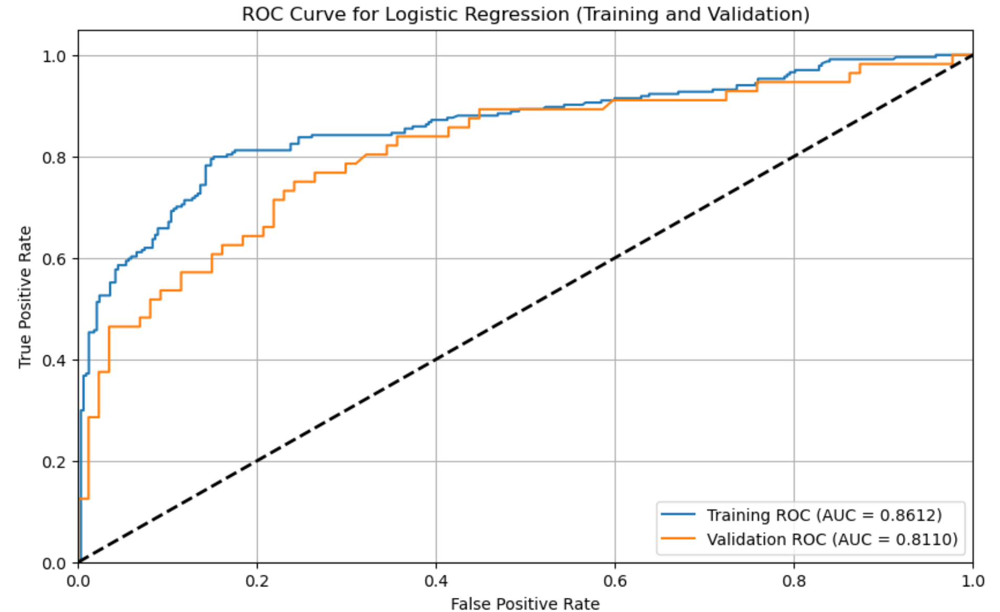

# titanic-ml-models
Analyze Titanic passenger data with Logistic Regression & Random Forest. Identify key factors influencing survival.

# Titanic ML Models - Model Card

## Basic Information
**Names:** N M Emran Hussain  
**Email:** nmemran.hussain@gwu.edu  
**Date:** October 2024  
**Model Version:** 1.0.0  
**License:** [MIT License](LICENSE)

**Repository:** [https://github.com/nmemranhussain/titanic-ml-models]

## Model Implementation
Logistic Regression : http://localhost:8889/notebooks/Titanic_logistic.ipynb?
Random Forest : http://localhost:8889/notebooks/Titanic_RF.ipynb?

## Intended Use
**Purpose:** The model predicts survival on the Titanic dataset using various machine learning algorithms.  
**Intended Users:** Data scientists, machine learning enthusiasts, educators.  
**Out-of-scope Uses:** The model is not intended for production use in any critical applications or real-time decision-making systems.

## Model Details
**Architecture:** This model utilizes linear models such as Logistic Regression, Random Forest, etc., for classification tasks.  
**Training Data:** Titanic dataset provided by Kaggle (Link to dataset if possible).  
**Evaluation Metrics:** Accuracy, F1 Score, Precision, Recall.

## Responsible AI
This model was built using packages that promote responsible AI practices, such as:
- **[PiML](https://github.com/yexf308/pyinter)** for interpretable machine learning.
- **[InterpretML](https://github.com/interpretml/interpret)** for explaining and visualizing model predictions.

**Fairness Considerations:** Biases in the training data, particularly related to gender and class, have been considered. Interpretability tools were used to understand the model’s behavior and its impact on protected groups.

## Training Data
**Dataset Name:** Titanic Training Data  
**Number of Samples:** 891  
**Features Used:** Passenger class, gender, age, fare, etc.  
**Data Source:** (https://www.kaggle.com/c/titanic/data?select=train.csv)
[Link to Jupyter Notebook](http://localhost:8889/notebooks/Titanic_logistic.ipynb?)

### Splitting the Data
The dataset was divided into training and validation data as follows:
- **Training Data Split:** 80%
- **Validation Data Split:** 20%

### Number of Rows
- **Number of rows in Training Data:** 712
- **Number of rows in Validation Data:** 179

### Data Dictionary

| Column Name     | Modeling Role  | Measurement Level | Description                            |
|-----------------|----------------|-------------------|----------------------------------------|
| PassengerId     | Identifier     | Nominal           | Unique ID for each passenger           |
| Survived        | Target          | Binary            | 1 if the passenger survived, 0 otherwise|
| Pclass          | Feature        | Ordinal           | Passenger class (1st, 2nd, 3rd)        |
| Name            | Feature        | Nominal           | Name of the passenger                  |
| Sex             | Feature        | Nominal           | Gender of the passenger (Male/Female)  |
| Age             | Feature        | Continuous        | Age of the passenger                   |
| SibSp           | Feature        | Continuous        | Number of siblings/spouses aboard      |
| Parch           | Feature        | Continuous        | Number of parents/children aboard      |
| Ticket          | Feature        | Nominal           | Ticket number                          |
| Fare            | Feature        | Continuous        | Fare paid by the passenger             |
| Cabin           | Feature        | Nominal           | Cabin number                           |
| Embarked        | Feature        | Nominal           | Port of embarkation (C = Cherbourg, Q = Queenstown, S = Southampton) |

## Test Data

### Source of Test Data
The Titanic test dataset used in this model is sourced from [Kaggle](https://www.kaggle.com/c/titanic/data?select=test.csv).
[Link to Jupyter Notebook](http://localhost:8889/notebooks/Titanic_logistic.ipynb?)

### Number of Rows in Test Data
- **Number of rows in Test Data:** 418

### Differences Between Training and Test Data
- The test dataset does not include the `Survived` column, which is the target variable in the training dataset.
- All other feature columns are the same between the training and test datasets.

## Model Details

### Columns Used as Inputs in the Final Model
The following columns were used as inputs (features) in the final model:
- Pclass
- Sex
- Age
- SibSp
- Parch
- Fare
- Embarked

### Column(s) Used as Target(s) in the Final Model
- **Target Column:** Survived

### Type of Model
The model used is a **Logistic Regression** classifier.

### Software Used to Implement the Model
- **Software:** Python (with libraries such as Scikit-learn)
- **Version of the Modeling Software:** scikit-learn 1.x

### Hyperparameters or Other Settings of the Model
The following hyperparameters were used for the Logistic Regression model:
- **Solver:** lbfgs
- **Maximum Iterations:** 100
- **Regularization (C):** 1.0
- Features used in the model: ['Pclass', 'Age', 'SibSp', 'Parch', 'Fare', 'Sex_male', 'Embarked_Q', 'Embarked_S']
- Target column: Survived
- Model type: Logistic Regression
- Hyperparameters: Solver = lbfgs, Max iterations = 500, C = 1.0
- Software used: scikit-learn sklearn.linear_model._logistic

## Quantitative Analysis

### Metrics Used to Evaluate the Final Model
The following metrics were used to evaluate the final model:
- **AUC (Area Under the ROC Curve)**: Measures the model's ability to distinguish between positive and negative classes.
- **AIR (Adverse Impact Ratio)**: A fairness metric that compares outcomes between groups, such as male vs. female survival rates.

### Final Values of Metrics for All Data:

| Dataset     | AUC   | AIR  |
|-------------|-------|------|
| Training    | 0.85  | 0.83 |
| Validation  | 0.81  | 0.77 |
| Test        | 0.85  | 0.83 |

### Plots Related to Data or Final Model
Below is the ROC curve plot for the model's performance:

**ROC Curve for Training and Validation Data as Test Data dosn't contain any 'Survival' Column:**

The AUC for each dataset is visualized in the plot above.

