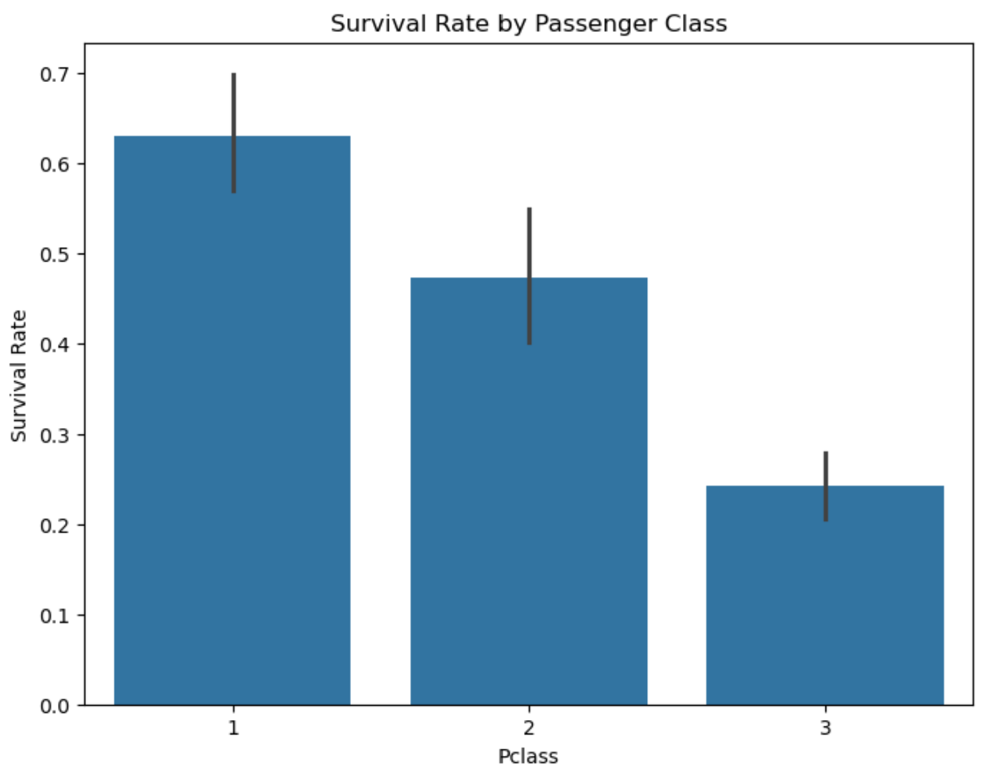
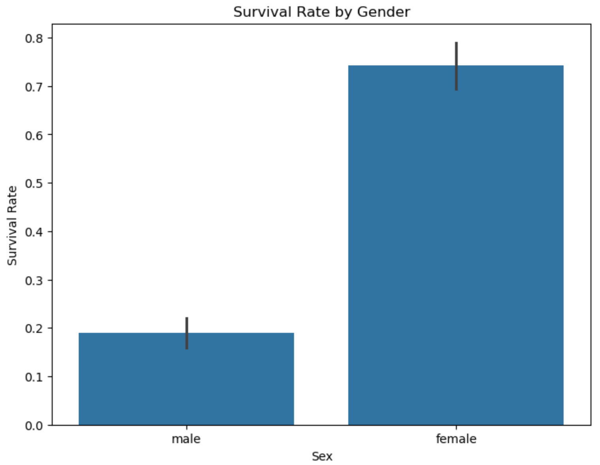

# Titanic ML Models - Model Card

Analyze Titanic passenger data with Logistic Regression & Random Forest. Identify key factors influencing survival.

## Basic Information
**Names:** N M Emran Hussain  
**Email:** nmemranhussain2023@gmail.com  
**Date:** October 2024  
**Model Version:** 1.0.0  
**License:** [MIT License](LICENSE)

## Intended Use
**Purpose:** The model predicts survival on the Titanic dataset using various machine learning algorithms.  
**Intended Users:** Data Analysts, Data scientists, machine learning enthusiasts, educators.  
**Out-of-scope Uses:** The model is not intended for production use in any critical applications or real-time decision-making systems.

## Training Data
**Dataset Name:** Titanic Training Data  
**Number of Samples:** 891  
**Features Used:** Passenger class, gender, age, fare, etc.  
**Data Source:** [kaggle](https://www.kaggle.com/c/titanic/data?select=train.csv)

### Splitting the Data for logistic regression model
The dataset was divided into training and validation data as follows:
- **Training Data Split:** 80%
- **Validation Data Split:** 20%

### Data Dictionary

| Column Name     | Modeling Role  | Measurement Level | Description                            |
|-----------------|----------------|-------------------|----------------------------------------|
| PassengerId     | Identifier     | Nominal           | Unique ID for each passenger           |
| Survived        | Target         | Binary            | 1 if the passenger survived, 0 otherwise|
| Pclass          | Feature        | Ordinal           | Passenger class (1st, 2nd, 3rd)        |
| Name            | Feature        | Nominal           | Name of the passenger                  |
| Sex             | Feature        | Nominal           | Gender of the passenger (Male/Female)  |
| Age             | Feature        | Continuous        | Age of the passenger                   |
| SibSp           | Feature        | Continuous        | Number of siblings/spouses aboard      |
| Parch           | Feature        | Continuous        | Number of parents/children aboard      |
| Ticket          | Feature        | Nominal           | Ticket number                          |
| Fare            | Feature        | Continuous        | Fare paid by the passenger             |
| Cabin           | Feature        | Nominal           | Cabin number                           |
| Embarked        | Feature        | Nominal           | Port of embarkation (C = Cherbourg, Q = Queenstown, S = Southampton) |

## Test Data

### Source of Test Data
- The Titanic test dataset used in this model is sourced from [Kaggle](https://www.kaggle.com/c/titanic/data?select=gender_submission.csv).

### Number of Rows in Test Data
- **Number of rows in Test Data:** 418

### Differences Between Training and Test Data
- The training data includes the target variable (Survived), allowing us to train and evaluate the model, while the test data lacks this target, so it’s used solely for generating predictions to assess model performance on unseen data.
- All other feature columns are the same between the training and test datasets.

## Model Details
### Architecture  
- This model card utilizes linear model such as **Logistic Regression**. As an alternative model **Random Forest** is used.  

### Evaluation Metrics  
- AUC (Area Under the ROC Curve): Measures the model's ability to distinguish between positive and negative classes.

### Final Values of Metrics for All Data using 'logistic regression' model:

| Dataset     | AUC   | 
|-------------|-------|
| Training    | 0.78  | 
| Validation  | 0.80  |
| Test        | 0.76  | 

### Columns Used as Inputs in the Final Model
The following columns were used as inputs (features) in the final model:
- Pclass
- Sex
- Age
- SibSp
- Parch
- Fare
- Embarked

### Column(s) Used as Target(s) in the Final Model
- **Target Column:** Survived

### Type of Models
* **[Logistic Regression Classifier](https://github.com/nmemranhussain/titanic-ml-models/blob/main/Titanic_logistic%20(1).ipynb)**
* **[Random Forest Classifier](https://github.com/nmemranhussain/titanic-ml-models/blob/main/Titanic_RF.ipynb)**

### Software Used to Implement the Model
- **Software:** Python (with libraries such as Pandas, Scikit-learn, seaborn & matplotlib)

### Version of the Modeling Software: 
- **'pandas'**: '2.2.2',
- **'scikit-learn'**: '1.4.2',
- **'seaborn'**: '0.13.2',
- **'matplotlib'**: '3.8.4**

### Hyperparameters or Other Settings of the Model
The following hyperparameters were used for the 'logistic regression' model:
- **Solver:** lbfgs
- **Maximum Iterations:** 100
- **Regularization (C):** 1.0
- **Features used in the model**: ['Pclass', 'Age', 'SibSp', 'Parch', 'Fare', 'Sex_male', 'Embarked_Q', 'Embarked_S']
- **Target column**: Survived
- **Model type**: Logistic Regression
- **Hyperparameters**: Solver = lbfgs, Max iterations = 500, C = 1.0
- **Software used**: scikit-learn sklearn.linear_model._logistic

The following hyperparameters were used for the 'random forest' as an alternative model:
- **Columns used as inputs**: ['Pclass', 'Sex', 'Age', 'SibSp', 'Parch', 'Fare', 'Embarked'], 
- **Target column**: 'Survived',
- **Type of model**: 'Random Forest Classifier',
- **Software used**: 'scikit-learn',

## Quantitative Analysis

### Plots Related to Data or Final Model
 
 

**Description**: Passengers in 1st class had the highest survival rate, followed by those in 2nd class. 3rd class passengers had the lowest survival rate.

 

**Description**: Females had a significantly higher survival rate than males, aligning with the negative coefficient for the "Sex" feature in the logistic regression model.

 

**Description**: Children (ages 0-12) had the highest survival rate, while seniors (ages 50-80) had the lowest. Young adults and adults had relatively similar survival rates, though slightly lower than children.

## Potential Impacts, Risks, and Uncertainties using Logistic Regression & Random Forest Model ##
Logistic regression offers a powerful tool for classification tasks. However, it is crucial to acknowledge its limitations. The model assumes a linear relationship between features and the outcome, which could overlook complex patterns in the data. This can lead to biased predictions, particularly when dealing with sensitive attributes like gender or class. Additionally, the probabilistic nature of the output can be misinterpreted as deterministic, potentially leading to misinformed decisions. To mitigate these risks and promote responsible AI practices, this model development employed several strategies. First, the training data was thoroughly examined for potential disparities related to gender and class. Second, interpretability tools from libraries like PiML were used to analyze the model's decision-making process and its impact on different groups. By incorporating these responsible AI practices, we aimed to ensure fairer and more transparent outcomes from the logistic regression model.

While random forests boast strong performance in classification tasks, they also present challenges. Their complex structure can be difficult to interpret, hindering explainability. Despite resilience to noise, random forests can still be susceptible to overfitting if not carefully tuned. Furthermore, biased training data can lead to unfair predictions. Additionally, their reliance on multiple decision trees can obscure the true influence of individual features, and their performance is sensitive to data quality and hyperparameter tuning. This can lead to unexpected patterns with potentially positive or negative consequences. Similar to the logistic regression model, responsible AI practices were prioritized during development. The training data was rigorously scrutinized for biases, particularly regarding gender and class. Tools from InterpretML were utilized to understand the model's behavior and its potential impact on protected groups. By fostering responsible AI throughout the development process, we aimed to ensure fairer and more interpretable predictions from the random forest model.

